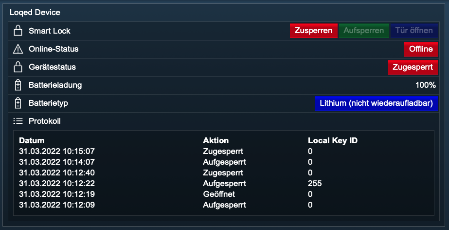
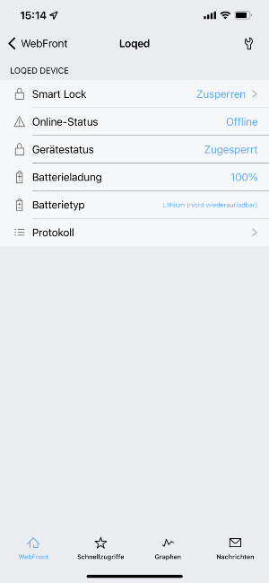

[](https://loqed.com)

### LOQED Device

Dieses Modul integriert ein [LOQED Smart Lock](https://loqed.com) in [IP-Symcon](https://www.symcon.de) mittels der lokalen Bridge.  

Das einzige Schloss, das Ihre Tür mit einer Berührung öffnet.

Für dieses Modul besteht kein Anspruch auf Fehlerfreiheit, Weiterentwicklung, sonstige Unterstützung oder Support.  
Bevor das Modul installiert wird, sollte unbedingt ein Backup von IP-Symcon durchgeführt werden.  
Der Entwickler haftet nicht für eventuell auftretende Datenverluste oder sonstige Schäden.  
Der Nutzer stimmt den o.a. Bedingungen, sowie den Lizenzbedingungen ausdrücklich zu.  

### Inhaltverzeichnis

1. [Funktionsumfang](#1-funktionsumfang)
2. [Voraussetzungen](#2-voraussetzungen)
3. [Software-Installation](#3-software-installation)
4. [Einrichten der Instanzen in IP-Symcon](#4-einrichten-der-instanzen-in-ip-symcon)
5. [Statusvariablen und Profile](#5-statusvariablen-und-profile)
6. [WebFront](#6-webfront)
7. [PHP-Befehlsreferenz](#7-php-befehlsreferenz)

### 1. Funktionsumfang

* Schloss zu- und aufsperren inkl. weiterer Funktionen
* Gerätestatus anzeigen (diverse)
* Protokoll

### 2. Voraussetzungen

- IP-Symcon ab Version 6.0
- LOQED Smart Lock
- LOQED Bridge
- API Konfiguration aus dem [LOQED API Configuration Portal](https://app.loqed.com/API-Config/)

### 3. Software-Installation

* Bei kommerzieller Nutzung (z.B. als Einrichter oder Integrator) wenden Sie sich bitte zunächst an den Autor.
* Über den Module Store das `Loqed`-Modul installieren.

### 4. Einrichten der Instanzen in IP-Symcon

- Nutzen Sie die `Loqed Discovery` Instanz, um das `Loqed Device` automatisch anzulegen.
- [Dokumentation Loqed Discovery](../../../docs/Discovery/de/README.md)

Manuelle Einrichtung:

- In IP-Symcon an beliebiger Stelle `Instanz hinzufügen` auswählen und `Loqed Device` auswählen, welches unter dem Hersteller `Loqed` aufgeführt ist.
- Es wird eine neue `Loqed Device` Instanz angelegt.

__Konfigurationsseite__:

| Name                                   | Beschreibung                           |
|----------------------------------------|----------------------------------------|
| Gerätename                             | Gerätename                             |
| LOQED Bridge IP Adresse                | IP-Adresse der LOQED Bridge            |
| LOQED Bridge Port                      | Port der LOQED Bridge                  |
| Netzwerk Timeout                       | Netzwerk Timeout                       |
| Outgoing Webhooks via LOQED Bridge     |                                        |
| Device Config Key                      | Device Config Key                      |
| Automatische Statusaktualisierung      | Automatische Statusaktualisierung      |
| IP-Symcon Host IP-Adresse              | IP-Adresse von IP-Symcon               |
| IP-Symcon Host Port                    | Port von IP-Symcon                     |
| API Keys (incoming webhooks)           |                                        |
| Local Key ID                           | Local Key ID                           |
| Key                                    | Key                                    |
| Tägliches Zusperren                    | Tägliches Zusperren verwenden          |
| Zusperren um                           | Uhrzeit Zusperren                      |
| Tägliches Aufsperren                   | Tägliches Aufsperren verwenden         |
| Aufsperren um                          | Uhrzeit Aufsperren                     |
| Protokoll verwenden                    | Protokoll verwenden                    |
| Anzahl der maximalen Protokolleinträge | Anzahl der maximalen Protokolleinträge |

__Schaltflächen im Aktionsbereich__:

| Name                       | Beschreibung                  |
|----------------------------|-------------------------------|
| Entwicklerbereich          |                               |
| Gerätestatus aktualisieren | Aktualisiert den Gerätestatus |
| Webhooks                   |                               |
| Anzeigen                   | Webhooks anzeigen             |
| Löschen                    | Webhook mit der ID löschen    |

__Vorgehensweise__:  

Registrieren Sie sich bitte im [LOQED API Configuration Portal](https://app.loqed.com/API-Config/) für die benötigten Daten.  
Geben Sie Ihre Daten an und übernehmen Sie anschließend die Änderungen.

### 5. Statusvariablen und Profile

Die Statusvariablen/Kategorien werden automatisch angelegt.  
Das Löschen einzelner kann zu Fehlfunktionen führen.

##### Statusvariablen

| Name          | Typ     | Beschreibung                                                  |
|---------------|---------|---------------------------------------------------------------|
| SmartLock     | integer | Smart Lock Aktionen (auf- und zusperren + weitere Funktionen) |
| OnlineState   | integer | Onlinestatus                                                  |
| DeviceState   | integer | Gerätestatus (diverse)                                        |
| BatteryCharge | integer | Batterieladung (in %)                                         |
| BatteryType   | integer | Batterietyp                                                   |
| ActivityLog   | string  | Protokoll                                                     |

##### Profile:

LOQED.InstanzID.Name

| Name          | Typ     |
|---------------|---------|
| SmartLock     | integer |
| OnlineState   | integer |
| DeviceState   | integer |
| BatteryCharge | integer |
| BatteryType   | integer |

Wird die Instanz gelöscht, so werden automatisch die oben aufgeführten Profile gelöscht.

### 6. WebFront

Die Funktionalität, die das Modul im WebFront bietet:  

[]()  

[]()

* Smart Lock Aktionen (auf- und zusperren + weitere Funktionen)
* Gerätestatus anzeigen (diverse)
* Protokoll
 
### 7. PHP-Befehlsreferenz

```text
Smart Lock schalten:  

LOQED_SetSmartLockAction(integer $InstanzID, int $Aktion);

Schaltet eine bestimmte Aktion des Smart Locks.  
Gibt bei Erfolg als Rückgabewert true zurück, andernfalls false.  

$InstanzID:     Instanz ID des Smart Locks
$Aktion:        Führt eine Aktion für das Smart Lock gemäss Tabelle aus:  
```

| Wert | Smart Lock Aktion | Smart Lock Aktion (deutsch) |
|------|-------------------|-----------------------------|
| 0    | lock              | zusperren                   |
| 1    | unlock            | aufsperren                  |
| 2    | open              | öffnen                      |

```text
Beispiel:  
//Smart Lock zusperren
$setAction = LOQED_SetSmartLockAction(12345, 0); 
//Gibt den Rückgabewert aus
echo $setAction;      

//Smart Lock aufsperren
$setAction = LOQED_SetSmartLockAction(12345, 1);
//Gibt den Rückgabewert aus
echo $setAction;      
```

```text
Status aktualisieren:  

LOQED_UpdateDeviceState(integer $InstanzID);  

Fragt den aktuellen Status des Smart Locks ab und aktualisiert die Werte der entsprechenden Variablen.  
Gibt bei Erfolg als Rückgabewert true zurück, andernfalls false. 

Beispiel:  
LOQED_UpdateDeviceState(12345);  
```  