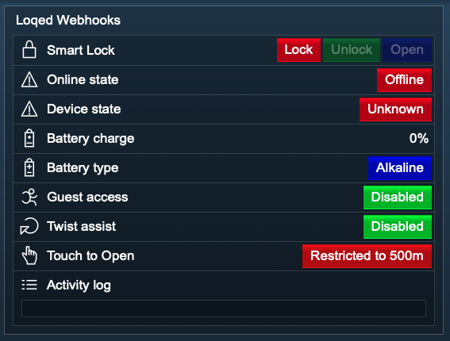

[](https://loqed.com)

### Loqed Smart Lock

This module integrates a [LOQED Smart Lock](https://loqed.com) into [IP-Symcon](https://www.symcon.de), the only lock that opens your door with a single tap.  

For this module there is no claim for further development, other support or can include errors.  
Before installing the module, a backup of IP-Symcon should be performed.  
The developer is not liable for any data loss or other damages.  
The user expressly agrees to the above conditions, as well as the license conditions.

### Table of contents

1. [Scope of functions](#1-scope-of-functions)
2. [Requirements](#2-requirements)
3. [Software installation](#3-software-installation)
4. [Setting up the instance](#4-setting-up-the-instance)
5. [Statevariables and profiles](#5-statevariables-and-profiles)
6. [WebFront](#6-webfront)
7. [PHP command reference](#7-php-command-reference)

### 1. Scope of functions

* Unlock, lock and open
* Display device status (various)

### 2. Requirements

- IP-Symcon at least version 6.0
- Loqed Smart Lock
- Activated webhooks on [Loqed Web Portal](https://loqed.com/pages/support#reamaze#0#/kb/integrations/webhooks-en)
- Internet connection
- IP-Symcon subscription (for automatic device state updates)

### 3. Software installation

* For commercial use (e.g. as an integrator), please contact the author first.
* Use the `Module Store` for installing the `Loqed`-Module.

### 4. Setting up the instance

- In IP-Symcon select `Add instance` at any place and select `Loqed` which is listed under the manufacturer `Loqed`.
- A new `Loqed` instance will be created.

__Configuration__:

Name                | Description
------------------- | -----------------
Device ID           | Device ID
API Key             | API Key
API Token           | API Token
Local Key ID        | Local Key ID
Lock ID             | Lock ID
Daily Update Time   | Daily Update Time

__Buttons in the action area__:

Name                    | Description
----------------------- | --------------------------------
Webhook URL             |
Developer area          |
Update device state     | Updates the state of the device

__Procedure__:

Please register first on the [Loqed Web Portal](https://loqed.com/pages/support#reamaze#0#/kb/integrations/webhooks-en) for the required webhooks.  
Enter your data for the smart lock and then apply the changes.

### 5. Statevariables and profiles

The state variables/categories are created automatically.  
Deleting individual ones can lead to malfunctions.

##### Statusvariables

Name                            | Type    | Description
------------------------------- | ------- | --------------------------------
SmartLock                       | integer | Unlock, lock and open Smart Lock
OnlineState                     | integer | Online state
DeviceState                     | integer | Device state (various)
BatteryCharge                   | integer | Battery charge (in %)
BatteryType                     | integer | Battery type
GuestAccess                     | integer | Guest access
TwistAssist                     | integer | Twist assist
TouchToConnect                  | integer | TouchToConnect

##### Profile:

LOQED.InstanceID.Name

Name                    | Type
----------------------- | -------
SmartLock               | integer
OnlineState             | integer
DeviceState             | integer
BatteryCharge           | integer
BatteryType             | integer
GuestAccess             | integer
TwistAssist             | integer
TouchToConnect          | integer

If the `Loqed` instance is deleted, the profiles listed above are automatically deleted.

### 6. WebFront

The functionality provided by the module in the WebFront:

[]()

* Unlock, lock and open
* Display device status (various)

### 7. PHP command reference

```text
Set smart lock action:  

LOQED_SetSmartLockAction(integer $InstanceID, int $Action);

Switches a specific action of the smart lock.  
Returns true if successful, false otherwise.  

$InstanceID:    Instance ID of the smart lock 
$Action:        Executes an action for the smart lock according to the table:  
```

Value   | Smart lock action            
------- | ----------------- 
0       | lock                         
1       | unlock 
2       | open 

```text
Example:  
//Lock smart lock
$setAction = LOQED_SetSmartLockAction(12345, 0); 
//Outputs the return value
echo $setAction;      

//Unlock smart lock
$setAction = LOQED_SetSmartLockAction(12345, 1);
//Outputs the return value
echo $setAction;      
```

```text
Update device state:  

LOQED_UpdateDeviceState(integer $InstanzID);  

Queries the current status of the smart lock and updates the values of the corresponding variables.  
Returns true if successful, false otherwise. 

Example:  
LOQED_UpdateDeviceState(12345);  
```  