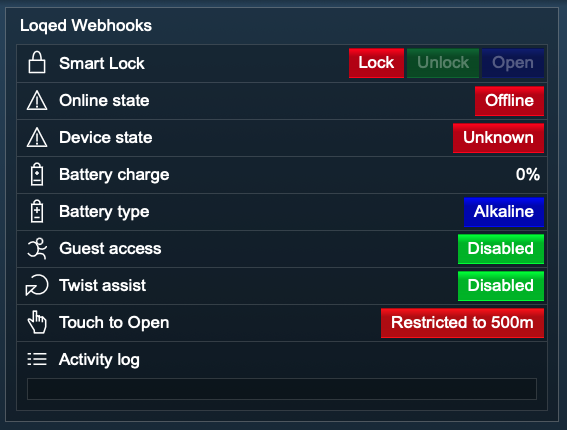
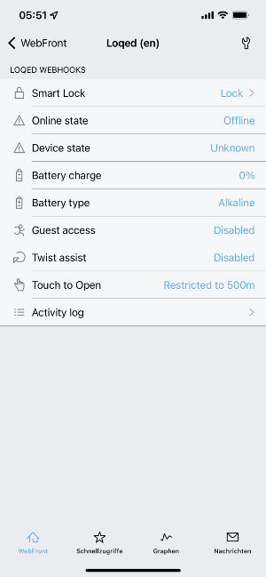

[](https://loqed.com)

### LOQED Webhooks

This module integrates a [LOQED Smart Lock](https://loqed.com) into [IP-Symcon](https://www.symcon.de) using Webhooks.  

The only lock that opens your door with a single tap.  

For this module there is no claim for further development, other support or can include errors.  
Before installing the module, a backup of IP-Symcon should be performed.  
The developer is not liable for any data loss or other damages.  
The user expressly agrees to the above conditions, as well as the license conditions.

### Table of contents

1. [Scope of functions](#1-scope-of-functions)
2. [Requirements](#2-requirements)
3. [Software installation](#3-software-installation)
4. [Setting up the instance](#4-setting-up-the-instance)
5. [Statevariables and profiles](#5-statevariables-and-profiles)
6. [WebFront](#6-webfront)
7. [PHP command reference](#7-php-command-reference)

### 1. Scope of functions

* Unlock, lock and open
* Display device status (various)
* Activity log

### 2. Requirements

- IP-Symcon at least version 6.0
- Loqed Smart Lock
- Activated webhooks on [LOQED Web Portal](https://loqed.com/pages/support#reamaze#0#/kb/integrations/webhooks-en)
- Internet connection
- IP-Symcon subscription (for automatic device state updates)

### 3. Software installation

* For commercial use (e.g. as an integrator), please contact the author first.
* Use the `Module Store` for installing the `Loqed`-Module.

### 4. Setting up the instance

- In IP-Symcon select `Add instance` at any place and select `Loqed Webhooks` which is listed under the manufacturer `Loqed`.
- A new `Loqed Webhooks` instance will be created.

__Configuration__:

| Name                               | Description                        |
|------------------------------------|------------------------------------|
| LOQED Webhooks Documentation       |                                    |
| Lock ID (old)                      | Lock ID (old)                      |
| API Key                            | API Key                            |
| API Token                          | API Token                          |
| Local Key ID                       | Local Key ID                       |
| Lock ID                            | Lock ID                            |
| Use daily status update            | Use daily status update            |
| Daily update time                  | Daily update time                  |
| Use daily lock                     | Use daily lock                     |
| Daily lock time                    | Daily lock time                    |
| Use daily unlock                   | Use daily unlock                   |
| Daily unlock time                  | Daily unlock time                  |
| Use activity log                   | Use activity log                   |
| Number of maximum activity entries | Number of maximum activity entries |

__Buttons in the action area__:

| Name                  | Description                     |
|-----------------------|---------------------------------|
| Webhook URL           |                                 |
| LOQED Webhooks Portal |                                 |
| Developer area        |                                 |
| Update device state   | Updates the state of the device |

__Procedure__:

Please register first on the [LOQED Web Portal](https://loqed.com/pages/support#reamaze#0#/kb/integrations/webhooks-en) for the required webhooks.  
Enter your data for the smart lock and then apply the changes.

### 5. Statevariables and profiles

The state variables/categories are created automatically.  
Deleting individual ones can lead to malfunctions.

##### Statusvariables

| Name          | Type    | Description                      |
|---------------|---------|----------------------------------|
| SmartLock     | integer | Unlock, lock and open Smart Lock |
| OnlineState   | integer | Online state                     |
| DeviceState   | integer | Device state (various)           |
| BatteryCharge | integer | Battery charge (in %)            |
| BatteryType   | integer | Battery type                     |
| GuestAccess   | integer | Guest access                     |
| TwistAssist   | integer | Twist assist                     |
| TouchToOpen   | integer | Touch To Open                    |
| ActivityLog   | string  | Activity log                     |

##### Profile:

LOQED.InstanceID.Name

| Name          | Type    |
|---------------|---------|
| SmartLock     | integer |
| OnlineState   | integer |
| DeviceState   | integer |
| BatteryCharge | integer |
| BatteryType   | integer |
| GuestAccess   | integer |
| TwistAssist   | integer |
| TouchToOpen   | integer |

If the `Loqed` instance is deleted, the profiles listed above are automatically deleted.

### 6. WebFront

The functionality provided by the module in the WebFront:

[]()

[]()

* Unlock, lock and open
* Display device status (various)
* Activity log

### 7. PHP command reference

```text
Set smart lock action:  

LOQED_SetSmartLockAction(integer $InstanceID, int $Action);

Switches a specific action of the smart lock.  
Returns true if successful, false otherwise.  

$InstanceID:    Instance ID of the smart lock 
$Action:        Executes an action for the smart lock according to the table:  
```

| Value | Smart lock action |
|-------|-------------------|
| 0     | lock              |
| 1     | unlock            |
| 2     | open              |

```text
Example:  
//Lock smart lock
$setAction = LOQED_SetSmartLockAction(12345, 0); 
//Outputs the return value
echo $setAction;      

//Unlock smart lock
$setAction = LOQED_SetSmartLockAction(12345, 1);
//Outputs the return value
echo $setAction;      
```

```text
Update device state:  

LOQED_UpdateDeviceState(integer $InstanzID);  

Queries the current status of the smart lock and updates the values of the corresponding variables.  
Returns true if successful, false otherwise. 

Example:  
LOQED_UpdateDeviceState(12345);  
```  